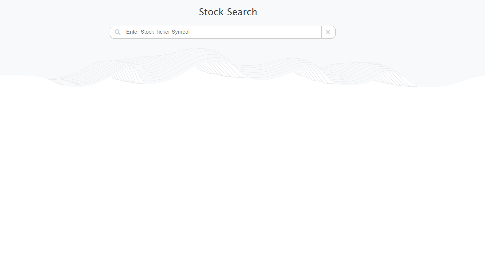
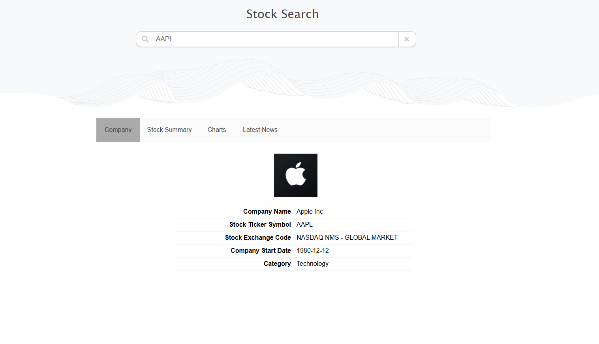

# Stock Insight Dashboard

A Flask-based web application for exploring real-time stock information. This dashboard fetches live company profiles, stock quotes, historical charts, and the latest news using **Finnhub** and **Polygon.io** APIs, and presents them in a clean, interactive UI with HighCharts.

> **Note**: Due to academic integrity policies, full source code is not published. You’re welcome to contact me directly to discuss the code (excluding currently enrolled students).

---

## Tech Stack

- **Backend**: Python Flask (deployed on GCP App Engine)
- **Frontend**: HTML5, CSS3, Vanilla JS (no Bootstrap)
- **Visualization**: HighCharts.js
- **APIs**:
  - [Finnhub](https://finnhub.io/)
  - [Polygon.io](https://polygon.io/)

---

## Features

- 🔍 Real-time stock search (via ticker)
- 🏢 Company overview (logo, IPO, exchange, sector)
- 📈 Stock summary with daily stats & recommendation trends
- 📊 6-month interactive chart with stock price + volume
- 📰 Recent news (up to 5 articles per stock)
- 🎨 Dynamic tab interface with clean layout

---

## Screenshots

| Search Form & Results | Chart Visualization |
|-----------------------|---------------------|
|  |  |

---

## 📁 Project Structure

```
stock-insight-dashboard/ 
├── main.py 
├── requirements.txt 
├── template/ 
│ └── index.html 
├── static/ 
│ ├── styles/ 
│ │ ├── style.css 
│ │ └── script.js 
│ └── img/  
│ │ ├── GreenArrowUp.png 
│ │ ├── RedArrowDown.png 
│ │ └── ... 
│ ├── search-solid.svg 
│ └── times-solid.svg
```


---

## Sample Code Preview

```python
# Backend route in Flask
@app.route('/search', methods=['POST'])
def search():
    symbol = request.form.get('name').upper()
    company_info = fetch_company_profile(symbol)
    quote_data = fetch_quote(symbol)
    # ...
    return render_template('index.html', ...)

```
```
// Basic front-end interaction
document.getElementById('searchForm').addEventListener('submit', function(event) {
    event.preventDefault();
    const formData = new FormData(this);
    fetch('/search', { method: 'POST', body: formData })
        .then(res => res.text())
        .then(html => document.getElementById('chartContainer').innerHTML = html);
});
```
---

##  Setup & Run (Locally)
```bash
git clone https://github.com/yourusername/stock-insight-dashboard.git
cd stock-insight-dashboard
pip install -r requirements.txt
python main.py
```

---

##  Contact
ihanghua@usc.edu
Built for a course project at USC – cloud deployed & API-driven.

---

## License
This project is shared for demo and learning purposes. Please do not reuse without permission.